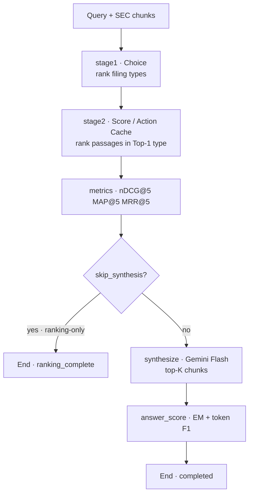

# finagent-mesh-mcp

Hybrid **financial agent** stack: LangGraph orchestration, open **System-1 decision models**, Gemini **System-2** synthesis, MCP tools, MLflow Runs/Traces, and a **FinAgentBench** harness.

**Target hardware**: HP ZGX Nano / NVIDIA DGX Spark (Grace Blackwell ARM64, ~128GB unified memory). Heavy engines are served **one at a time** (sequential exclusive GPU ports).

---

## Technical stack

| Layer | Technology | Role |
|---|---|---|
| Orchestration | **LangGraph** (+ LangChain Core) | Per-example agent graph: Stage 1 → Stage 2 → metrics → optional synthesize → answer score |
| System-1 | Local `/v1/systemone` sidecars (Decision-2.0 Lux/Kai, AnyJev L0, CLM, Laya, BM25, E5, Qwen3 AR) | Typed **Choice** (filing types) and **Score** / Action Cache (passages) |
| System-2 | **Gemini Flash** via `langchain-google-genai` | Fail-closed answer synthesis from top-K chunks (no extractive fallback) |
| Tools | **MCP** (`mcp-sec-edgar`, `mcp-financial-calculator`) via AgentGateway | Optional filing/calc enrichment (not required for FinAgentBench ranking smokes) |
| Observability | **MLflow 3** nested Runs + GenAI Traces | Per-example metrics + span tree (`mlflow.langchain.autolog` + manual spans) |
| Eval ledger | SQLite | Crash-resume, leases, ranking vs synthesis phases |
| Dataset | FinAgentBench (ICAIF’25 / Kaggle) | Document-type + chunk labels; nDCG@5 / MAP@5 / MRR@5 |
| Packaging | **uv** + Python 3.12, Typer CLI, Pydantic, httpx | `scripts/run_benchmark.py` drives the paper matrix |

Optional `--extra real`: torch, transformers, sentence-transformers, rank-bm25, huggingface-hub (weights/inference).

---

## Architecture: LangGraph agent

Each FinAgentBench example is one agentic execution. Ranking and synthesis can be split across ledger phases, but the **logical** pipeline is:



### Agentic process (what happens)

1. **Stage 1 (Choice)** — Five mutually exclusive filing types `{DEF14A, 10-K, 10-Q, 8-K, Earnings}` are scored by the Stage-1 engine. Top-1 becomes the recall gate for Stage 2.
2. **Stage 2 (Score)** — Passages of that Top-1 type are ranked (Lux ordinal Score, CLM Action Cache, BM25, E5, …). Empty Top-1 chunks fail closed (`empty_top1_chunks`).
3. **Metrics** — Stage-1/2 nDCG@5, MAP@5, MRR@5 vs FinAgentBench labels; Top-1 correctness recorded.
4. **Synthesize (optional)** — Gemini Flash answers from the top-`SYNTHESIS_K` chunks. Missing `GOOGLE_API_KEY` or API errors raise; **no** local extractive fake answer.
5. **Answer score** — Normalized exact match + token F1 when an answer label exists.

### Observability nesting

```text
MLflow parent Run (matrix run_id)
└─ nested Run (run_id:example_id)          ← metrics / tags / artifacts
   └─ Trace: finagent_example (AGENT)
      ├─ LangGraph nodes (autolog)
      ├─ systemone_choice / systemone_score (RETRIEVER)
      └─ gemini_synthesize (LLM)             ← only with --with-synthesis
```

Harness code: `src/finagent_mesh/agent/graph.py`, `runtime/harness.py`, `runtime/tracing.py`.

---

## Quick start: smoke test (verify the stack)

Use a **new `--run-id`** every smoke so the SQLite ledger does not resume an old run.

### 0. One-time setup

```bash
cp .env.example .env
# Required for --real:
#   SYSTEMONE_MOCK=0
#   SYSTEMONE_BACKEND=real
#   HF_TOKEN=…                 # Hub rate limits
#   GOOGLE_API_KEY=…           # only if --with-synthesis
#   KAGGLE_USERNAME / KAGGLE_KEY  # first FinAgentBench download only
#   MLFLOW_TRACKING_URI=sqlite:///mlflow.db

uv sync --extra real --group dev
./scripts/prepare_real_stack.sh
# Optional weight prefetch:
./scripts/prepare_real_stack.sh --prefetch
```

Create a Hugging Face **read** token at [HF settings/tokens](https://huggingface.co/settings/tokens). For Gemini, set `GOOGLE_API_KEY`. Accept Kaggle competition rules if data is not already under `data/finagentbench/`.

### 1. MLflow UI (separate terminal)

```bash
./scripts/mlflow_ui.sh
# or: uv run mlflow ui --backend-store-uri sqlite:///mlflow.db --port 5000
# http://127.0.0.1:5000 → experiment finagent-mesh
```

### 2. Minimal technical smoke (S1 + S2 + Gemini + MLflow)

Fastest full-path check (one pair, 5 examples):

```bash
uv run python scripts/run_benchmark.py --real --with-synthesis \
  --pairs lux-lux \
  --records 5 --seed 42 \
  --run-id paper-smoke-mlflow-gemini-5
```

**Pass criteria**

| Check | Expect |
|---|---|
| CLI | Run exits 0; artifacts under `artifacts/benchmarks/paper-smoke-mlflow-gemini-5.*` |
| Ranking | Stage-1 Top-1 and Stage-2 ranks in inspect HTML |
| Gemini | Non-empty synthesis; answer scores when labels exist |
| MLflow **Runs** | Nested runs with `stage1_top1_correct`, `stage1_ndcg_at_5` / `map_at_5` / `mrr_at_5`, `stage2_*`, `gemini_synthesis_ok`, `gemini_answer_*` |
| MLflow **Traces** | `finagent_example` → LangGraph nodes → `systemone_choice` / `systemone_score` → `gemini_synthesize` |

Ranking-only smoke (no Gemini / no API key):

```bash
uv run python scripts/run_benchmark.py --real \
  --pairs lux-lux --records 5 --seed 42 \
  --run-id paper-smoke-rank-5
```

Default Block A/B smoke (10 examples, ranking-only — longer GPU time):

```bash
uv run python scripts/run_benchmark.py --real \
  --records 10 --seed 42 \
  --run-id paper-smoke-10
```

---

## Full paper run

Default paper matrix = all **required** Block A/B pairs from `configs/engines.yaml` (`optional: false`). `--real` defaults to **ranking-only** and **N = min(200, dataset size)**.

```bash
uv run python scripts/run_benchmark.py --real --seed 42 --run-id paper-n200
```

With Gemini synthesis + answer scoring on the same sample:

```bash
uv run python scripts/run_benchmark.py --real --with-synthesis \
  --seed 42 --run-id paper-n200-synth
```

**What `--real` does**

1. Resolves Block A/B pairs (not “one engine + dummy partner” unless `--engines`).
2. Starts engines with `SYSTEMONE_BACKEND=real` (refuses `SYSTEMONE_MOCK=1`).
3. Force-restarts sidecars on ports 8000/8001/8002 unless `--keep-servers`.
4. Allocates ports so Block A can keep Lux Score warm on **:8001** while Choice variants swap on **:8000**.
5. Auto-fetches/converts FinAgentBench from Kaggle if missing (`--no-fetch-data` to disable).
6. Writes `artifacts/benchmarks/<run-id>.{json,csv,md,analysis.md,analysis.json,inspect.html,inspect.json}`.

```bash
less artifacts/benchmarks/paper-n200.analysis.md
# open artifacts/benchmarks/paper-n200.inspect.html
```

GPU policy: sequential exclusive heavies; keep Lux warm across Block A (shared Score) and Block B (shared Choice).

---

## Selective runs (examples)

```bash
# Catalog
uv run python scripts/run_benchmark.py --list-pairs
uv run python scripts/run_benchmark.py --list-engines

# Highest-value subset
uv run python scripts/run_benchmark.py --real \
  --pairs lux-lux,lux-bm25,kai-lux \
  --records 20 --seed 42 --run-id paper-core

# Optional Block B rows
uv run python scripts/run_benchmark.py --real --include-optional \
  --run-id paper-opt

# Explicit optional subset
uv run python scripts/run_benchmark.py --real \
  --pairs lux-clm-shortlist,one-shot-ar \
  --include-optional --records 5 --seed 42 \
  --run-id paper-opt-smoke

# Reuse warm sidecars (no force-restart)
uv run python scripts/run_benchmark.py --real --keep-servers \
  --pairs lux-lux --records 5 --seed 42 --run-id warm-reuse

# Force kill leftover servers before run (also default under --real)
uv run python scripts/run_benchmark.py --real --force-restart \
  --pairs lux-lux --records 5 --run-id forced

# Do not start/stop servers (you manage serve_engine.sh yourself)
uv run python scripts/run_benchmark.py --real --no-manage-servers \
  --pairs lux-lux --records 5 --run-id external-servers

# Custom Gemini model
uv run python scripts/run_benchmark.py --real --with-synthesis \
  --gemini-model gemini-2.5-flash \
  --pairs lux-lux --records 3 --run-id gemini-custom

# Custom dataset / output dir
uv run python scripts/run_benchmark.py --real \
  --dataset-path ./data/finagentbench \
  --out-dir ./artifacts/benchmarks \
  --records 10 --run-id custom-paths

# Rebuild reports without engines
uv run python scripts/run_benchmark.py --analysis-from paper-n200
uv run python scripts/run_benchmark.py --inspect-from paper-n200

# Legacy one-variable ablation (fixed partners, not Block A/B)
uv run python scripts/run_benchmark.py --real \
  --engines decision20-kai,clm-8b --run-id ablation
```

Stop leftovers by hand: `bash scripts/serve_engine.sh stop-all`.

---

## `run_benchmark.py` CLI reference

All flags for `uv run python scripts/run_benchmark.py`:

| Flag | Default | Meaning |
|---|---|---|
| `--real` | off | Production mode: real HF models, refuse mock, auto dataset gate, ranking-only unless `--with-synthesis`, default N=`min(200, dataset)`, force-restart sidecars unless `--keep-servers` |
| `--records` / `-n` | `--real` → 200 (capped); else all | Seeded sample size |
| `--seed` / `-s` | `42` | RNG seed for sampling |
| `--run-id` | `bench-YYYYMMDD-HHMMSS` | Matrix run id (ledger + artifact stem). Use a **new** id for a fresh smoke |
| `--pairs` / `-p` | all required Block A/B | Comma-separated `pair_id`s from `configs/engines.yaml` |
| `--engines` / `-e` | — | Legacy ablation: variable engines with fixed partners. **Mutually exclusive** with `--pairs` |
| `--include-optional` | off | Add optional pairs (`lux-clm-shortlist`, `one-shot-ar`) |
| `--include-baseline` | off | Legacy unlock for baseline-role optional pairs (Block A already includes `ar-lux`) |
| `--with-synthesis` | off | Enable Gemini Flash synthesis + answer scoring |
| `--skip-synthesis` | implied by `--real` | Explicit ranking-only (no Gemini) |
| `--gemini-model` | `GEMINI_MODEL` / `gemini-2.5-flash` | Override System-2 model id |
| `--dataset-path` | `FINAGENTBENCH_PATH` | FinAgentBench directory or JSONL |
| `--out-dir` | `artifacts/benchmarks` | Report output directory |
| `--min-examples` | `100` | With `--real`, minimum labeled examples required |
| `--fetch-data` / `--no-fetch-data` | fetch on | If local dump missing, download from Kaggle and convert |
| `--force-restart` | on with `--real` | Kill sidecars / ports 8000–8002 before the run |
| `--keep-servers` | off | With `--real`, reuse running sidecars (disables force-restart) |
| `--no-manage-servers` | off | Do not start/stop engines; you must serve them |
| `--allow-mock` | off | Debug only; **illegal** with `--real` |
| `--list-pairs` | — | Print matrix pairs (blocks, S1/S2, optional/deferred) and exit |
| `--list-engines` | — | Print registry engines and exit |
| `--analysis-from <run-id>` | — | Rebuild `.analysis.md/.json` (+ inspect) from a saved matrix; no engines |
| `--inspect-from <run-id>` | — | Rebuild `.inspect.html/.json` only; no engines |

Artifacts per run: `.json`, `.csv`, `.md` (interpret), `.analysis.md` / `.analysis.json` (Block A/B), `.inspect.html` / `.inspect.json` (per-example I/O).

---

## Why this benchmark exists

### FinAgentBench: agentic retrieval in finance

Institutional questions over SEC filings need **document structure** (which filing type?) and **passage evidence** (which chunks?). [Choi et al., *FinAgentBench*, ACM ICAIF 2025](https://dl.acm.org/doi/10.1145/3768292.3770362) provide ~26K annotated examples with two explicit steps and nDCG@5 / MAP@5 / MRR@5. The ICAIF’25 challenge dump (~2.4K) is what this repo fetches from Kaggle.

| Resource | Link |
|---|---|
| Paper (ACM DL) | [doi:10.1145/3768292.3770362](https://dl.acm.org/doi/10.1145/3768292.3770362) |
| UNIST record | [Scholarworks](http://scholarworks.unist.ac.kr/handle/201301/89409) |
| ICAIF’25 challenge | [ai4f.org/2025-challenge](https://ai4f.org/2025-challenge) |
| Kaggle data | [competition data](https://www.kaggle.com/competitions/acm-icaif-25-ai-agentic-retrieval-grand-challenge/data) |

### Open System-1 decision models

Specialized decision models return a **probability vector** for Choice / Score instead of uncalibrated JSON chat. Survey: [`Architectural Foundations for Open Decision Models.md`](Architectural%20Foundations%20for%20Open%20Decision%20Models.md).

| Pipeline stage | Job | Primitive |
|---|---|---|
| Stage 1 | Rank 5 filing types | **Choice** |
| Stage 2 | Rank passages | **Score** / Action Cache (Lux ordinal Score is pointwise relevance, not a chunk-list Criterion) |
| System 2 | Answer from evidence | Gemini Flash (fail-closed) |

Further reading: [Jev architecture probes](https://archerhume.com/posts/jevs-architecture-unmasked/), [Decision 1.0/2.0](https://vllm-sr.ai/blog/decision-models/), [CLM](https://github.com/Contrastive-LM/CLM), [AnyJev](https://github.com/nokia-applied-research/AnyJev) / [arXiv:2610.00831](https://arxiv.org/html/2610.00831v1), [JevBench](https://github.com/fstandhartinger/jevbench).

---

## Model matrix (selected vs not)

Survey latency / composite figures below are **not** FinAgentBench scores — use them for architectural fit, then run `--real`.

### In the harness

| Model | Architecture | Params / context | FinAgent Mesh role |
|---|---|---|---|
| **Decision-2.0 Lux-9B** | Qwen3.5 + Gated DeltaNet | ~8B / 16k | Shared Block A Score + Block B Choice (`decision20-lux`). Ordinal Score for Stage 2. [HF](https://huggingface.co/vllm-sr/Decision-2.0-Lux-9B) |
| **Decision-2.0 Kai-0.6B** | Vela encoder | 0.6B / 1k | Latency Stage-1 only. [HF](https://huggingface.co/vllm-sr/Decision-2.0-Kai-0.6B) |
| **CLM-8B** | Frozen Qwen3-8B dual encoder + InfoNCE heads | 8B+ / 2k | Stage-2 Action Cache. [HF](https://huggingface.co/Contrastive-LM/CLM-v0.1-8B) |
| **AnyJev L0** | Cyclic permutations on Lux Choice | inherits | Stage-1 order-bias control. [GitHub](https://github.com/nokia-applied-research/AnyJev) |
| **Laya (ModernBERT)** | Bidirectional MLM heads | 421M / 512 | Edge Stage-1 only. [HF](https://huggingface.co/ameerhmz5/laya-modernbert-decision-90pct) |
| **Qwen3-8B AR** | Autoregressive JSON | 8B | Generative baseline (`ar-lux`). Hub: [`Qwen/Qwen3-8B`](https://huggingface.co/Qwen/Qwen3-8B) |

### Default pairs (`configs/engines.yaml` → `matrix_pairs`)

**Block A** = Choice varies, Lux Score fixed. **Block B** = Score varies, Lux Choice fixed.

| Pair id | Block | Stage 1 | Stage 2 | Default |
|---|---|---|---|---|
| `lux-lux` | A+B | Lux | Lux | Required — shared physical run |
| `anyjev-l0-lux` | A | AnyJev L0 | Lux | Required |
| `kai-lux` / `laya-lux` | A | Kai / Laya | Lux | Required |
| `ar-lux` | A | Qwen3-8B JSON | Lux | Required baseline |
| `lux-clm` / `lux-bm25` / `lux-e5` | B | Lux | CLM / BM25 / E5 | Required |
| `lux-clm-shortlist` / `one-shot-ar` | B | Lux / noop | shortlist-CLM / AR | Optional (`--include-optional`) |

Deferred train/CE: issues [#1](https://github.com/caldeirav/finagent-mesh-mcp/issues/1), [#2](https://github.com/caldeirav/finagent-mesh-mcp/issues/2).

### Out of the default matrix

| Model | Why interesting | Why not default |
|---|---|---|
| Jev (TypeSafe) | Defines the System-1 bar | Hosted / proprietary |
| djev / DiffusionGemma | Multimodal | VRAM + not text-SEC chunks |
| Jeeves / SemIf / Solomon / Kev / other Decision-2.0 sizes | Family completeness | Overlap or memory vs sequential budget |
| CLM as Stage 1 / Laya·Kai as Stage 2 / AnyJev as Stage 2 | — | Wrong primitive or context/cost fit |

---

## MLflow Runs + Traces

Tracking defaults to **SQLite** (`MLFLOW_TRACKING_URI=sqlite:///mlflow.db`). The old `./mlruns` FileStore is maintenance-mode in MLflow 3 and needs `MLFLOW_ALLOW_FILE_STORE=true` if you keep it.

```bash
./scripts/mlflow_ui.sh
# Experiments → finagent-mesh → Runs | Traces
```

If you still have data only under `./mlruns`:

```bash
uv run mlflow migrate-filestore --source ./mlruns --target sqlite:///mlflow.db
```

| Surface | Contents |
|---|---|
| **Runs** (nested per example) | `stage1_top1_correct`, `stage1_ndcg_at_5` / `map_at_5` / `mrr_at_5`, `stage2_*`, `empty_top1_chunks`, `gemini_synthesis_ok`, `gemini_answer_normalized_em`, `gemini_answer_token_f1`; tags `stage1_top1`, `gemini_status`, engines |
| **Traces** | `finagent_example` → LangGraph nodes → `systemone_choice` / `systemone_score` → `gemini_synthesize` |

`mlflow.langchain.autolog(run_tracer_inline=True)` captures graph nodes; System-1 and Gemini add child spans. Set `MLFLOW_DISABLE_AUTOLOG=1` to disable autolog.

---

## Layout

- `scripts/run_benchmark.py` — paper Block A/B matrix + reports (`--real`)
- `scripts/mlflow_ui.sh` — MLflow UI with `.env` tracking URI (`sqlite:///mlflow.db`)
- `configs/engines.yaml` — engines, HF ids, **`matrix_pairs`**
- `scripts/download_finagentbench_kaggle.py` — fetch + convert ICAIF’25 dump
- `scripts/prepare_real_stack.sh` — torch/transformers; optional HF prefetch
- `scripts/serve_engine.sh` — start/stop/restart/health/`stop-all`
- `src/finagent_mesh/agent/graph.py` — LangGraph pipeline
- `src/finagent_mesh/runtime/harness.py` / `tracing.py` — ledger + MLflow
- `src/finagent_mesh/matrix/inspect.py` — per-example inspect HTML/JSON
- `src/finagent_mesh/clients/engines/real_infer.py` — Decision-2.0 / embed / AR / CLM
- `artifacts/benchmarks/` — JSON / CSV / Markdown / inspect / analysis
- Survey: [`Architectural Foundations for Open Decision Models.md`](Architectural%20Foundations%20for%20Open%20Decision%20Models.md)
- Specs: [`specs/003-choice-score-paper/`](specs/003-choice-score-paper/) · [`specs/002-decision-model-bench/`](specs/002-decision-model-bench/) · [`specs/001-finagentbench-harness/`](specs/001-finagentbench-harness/)
