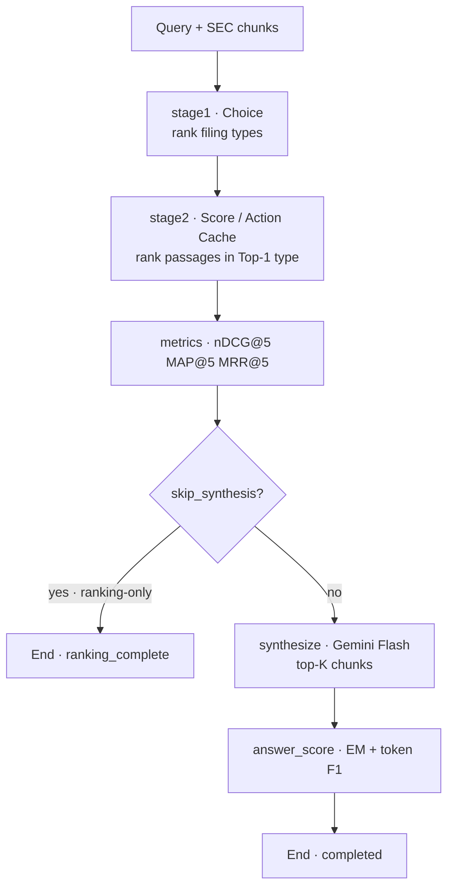

# finagent-mesh-mcp

Hybrid **financial agent** stack for evaluating open **System-1 decision models** on [FinAgentBench](https://dl.acm.org/doi/10.1145/3768292.3770362): typed **Choice** (which SEC filing type?) then **Score** / dense / lexical ranking (which passages?), with optional Gemini **System-2** answer synthesis, MCP tools, and MLflow Runs/Traces.

**Target hardware**: HP ZGX Nano / NVIDIA DGX Spark (Grace Blackwell ARM64, ~128GB unified memory). Heavy engines are served **one at a time** (sequential exclusive GPU ports).

---

## What this repo does

Institutional questions over SEC filings need **document structure** and **passage evidence**. This harness:

1. Samples FinAgentBench examples (document-type + chunk labels).
2. Runs a LangGraph agent: Stage-1 Choice → Stage-2 Score → nDCG@5 / MAP@5 / MRR@5 → optional Gemini synthesis + answer EM/F1.
3. Sweeps a **Choice × Score** paper matrix (Block A / Block B) across open decision models and strong baselines.
4. Writes paper-facing analysis, CSV/JSON tables, and per-example inspect HTML, with nested MLflow Runs/Traces for debugging.

Survey of System-1 architectures: [`Architectural Foundations for Open Decision Models.md`](Architectural%20Foundations%20for%20Open%20Decision%20Models.md).

---

## Why FinAgentBench

[Choi et al., *FinAgentBench*, ACM ICAIF 2025](https://dl.acm.org/doi/10.1145/3768292.3770362) provide ~26K annotated examples with two explicit retrieval steps and nDCG@5 / MAP@5 / MRR@5. This repo uses the ICAIF’25 challenge dump (~2.4K) from Kaggle.

| Resource | Link |
|---|---|
| Paper (ACM DL) | [doi:10.1145/3768292.3770362](https://dl.acm.org/doi/10.1145/3768292.3770362) |
| UNIST record | [Scholarworks](http://scholarworks.unist.ac.kr/handle/201301/89409) |
| ICAIF’25 challenge | [ai4f.org/2025-challenge](https://ai4f.org/2025-challenge) |
| Kaggle data | [competition data](https://www.kaggle.com/competitions/acm-icaif-25-ai-agentic-retrieval-grand-challenge/data) |

| Pipeline stage | Job | Primitive |
|---|---|---|
| Stage 1 | Rank 5 filing types `{DEF14A, 10-K, 10-Q, 8-K, Earnings}` | **Choice** |
| Stage 2 | Rank passages inside the Top-1 type | **Score** / Action Cache / BM25 / E5 |
| System 2 (optional) | Answer from top-K evidence | Gemini Flash (fail-closed) |

Further reading: [Jev architecture probes](https://archerhume.com/posts/jevs-architecture-unmasked/), [Decision 1.0/2.0](https://vllm-sr.ai/blog/decision-models/), [CLM](https://github.com/Contrastive-LM/CLM), [AnyJev](https://github.com/nokia-applied-research/AnyJev) / [arXiv:2610.00831](https://arxiv.org/html/2610.00831v1), [JevBench](https://github.com/fstandhartinger/jevbench).

---

## How the benchmark is built

**Block A** — Stage-1 **Choice** varies; Stage-2 Lux Score is fixed. Differences in Stage-1 nDCG@5 / Top-1 recall measure routing quality.

**Block B** — Stage-1 Lux Choice is fixed; Stage-2 **Score** (or BM25 / E5 / CLM) varies. Compare overall Stage-2 nDCG@5 (full pipeline) and **S2 nDCG@5|Top-1** (scorer quality when the filing type was correct).

Wrong Top-1 type yields `empty_top1_chunks` — a **routing** failure, not a scorer bug. Those examples contribute 0 to overall S2 nDCG and are excluded from conditional-on-Top-1 metrics.

Default matrix = required pairs in `configs/engines.yaml` (`optional: false`). `--real` defaults to **ranking-only** and **N = min(200, dataset size)**.

```text
MLflow parent Run (matrix run_id)
└─ nested Run (run_id:example_id)
   └─ Trace: finagent_example
      ├─ stage1 Choice → stage2 Score → metrics
      └─ (optional) gemini_synthesize → answer_score
```

---

## Models selected

Survey latency / composite figures are **not** FinAgentBench scores — they guide architectural fit; run `--real` for numbers.

### In the harness

| Model | Architecture | Params / context | FinAgent Mesh role |
|---|---|---|---|
| **Decision-2.0 Lux-9B** | Qwen3.5 + Gated DeltaNet | ~8B / 16k | Shared Block A Score + Block B Choice (`decision20-lux`). [HF](https://huggingface.co/vllm-sr/Decision-2.0-Lux-9B) |
| **Decision-2.0 Kai-0.6B** | Vela encoder | 0.6B / 1k | Fast Stage-1 Choice. [HF](https://huggingface.co/vllm-sr/Decision-2.0-Kai-0.6B) |
| **CLM-8B** | Frozen Qwen3-8B dual encoder + InfoNCE | 8B+ / 2k | Stage-2 Action Cache. [HF](https://huggingface.co/Contrastive-LM/CLM-v0.1-8B) |
| **AnyJev L0** | Cyclic permutations on Lux Choice | inherits | Stage-1 order-bias control. [GitHub](https://github.com/nokia-applied-research/AnyJev) |
| **Laya (ModernBERT)** | Bidirectional MLM heads | 421M / 512 | Edge Stage-1. [HF](https://huggingface.co/ameerhmz5/laya-modernbert-decision-90pct) |
| **Qwen3-8B AR** | Autoregressive JSON | 8B | Generative baseline (`ar-lux`). [HF](https://huggingface.co/Qwen/Qwen3-8B) |
| **BM25 / E5-base** | Lexical / dense | — | Strong Stage-2 baselines |

### Default pairs (`configs/engines.yaml` → `matrix_pairs`)

| Pair id | Block | Stage 1 | Stage 2 | Default |
|---|---|---|---|---|
| `lux-lux` | A+B | Lux | Lux | Required — shared physical run |
| `anyjev-l0-lux` | A | AnyJev L0 | Lux | Required |
| `kai-lux` / `laya-lux` | A | Kai / Laya | Lux | Required |
| `ar-lux` | A | Qwen3-8B JSON | Lux | Required baseline |
| `lux-clm` / `lux-bm25` / `lux-e5` | B | Lux | CLM / BM25 / E5 | Required |
| `lux-clm-shortlist` / `one-shot-ar` | B | Lux / noop | shortlist-CLM / AR | Optional (`--include-optional`) |

Deferred train/CE ceilings: issues [#1](https://github.com/caldeirav/finagent-mesh-mcp/issues/1), [#2](https://github.com/caldeirav/finagent-mesh-mcp/issues/2).

### Out of the default matrix

| Model | Why interesting | Why not default |
|---|---|---|
| Jev (TypeSafe) | Defines the System-1 bar | Hosted / proprietary |
| djev / DiffusionGemma | Multimodal | VRAM + not text-SEC chunks |
| Other Decision-2.0 sizes / Jeeves / SemIf / … | Family completeness | Overlap or memory vs sequential budget |
| CLM as Stage 1 / Laya·Kai as Stage 2 | — | Wrong primitive or context/cost fit |

---

## Results: paper-n200-full (N=200, seed=42)

Merged primary + retry matrix: **8/8 required pairs measured**, ranking-only (Gemini synthesis off). This is the single published full analysis under `artifacts/benchmarks/`.

### Headline findings

| Question | Winner | Key numbers |
|---|---|---|
| **Best Choice router (Block A)** | `anyjev-l0-lux` | S1 nDCG@5 **0.8625** (+0.021 vs Lux 0.8413); Top-1 recall 95.1%; OFR 9.0% |
| **Best passage scorer (Block B)** | `lux-e5` | S2 nDCG@5 **0.2825** scored-only (+0.061 vs Lux); pipeline-averaged **0.157** |
| **Routing / yield** | Lux Choice | Empty-Top-1 **40.5%**; pipeline yield **59.5%**. Many empties are **correct Top-1 + empty pool** (67/200), not only wrong type — see Routing accounting in the analysis. |

**Block A order (S1 nDCG@5):** AnyJev 0.862 → Lux 0.841 → Kai 0.783 → AR 0.777 → Laya 0.751.

**Block B order (scored-only S2 nDCG@5):** E5 0.282 → BM25 0.265 → Lux Score 0.221 → CLM 0.103. Win/tie/loss vs Lux (nDCG@5, ε=0.01): E5 51/26/34; BM25 51/23/37.

P0 analysis rebuild (no engines): `uv run python scripts/run_benchmark.py --analysis-from paper-n200-full` — adds routing classes, dual S2 series, strata, win/loss, bootstrap CIs.

### Detailed artifacts

| Artifact | Path |
|---|---|
| **Analysis (read this first)** | [`artifacts/benchmarks/paper-n200-full.analysis.md`](artifacts/benchmarks/paper-n200-full.analysis.md) |
| Analysis JSON | [`artifacts/benchmarks/paper-n200-full.analysis.json`](artifacts/benchmarks/paper-n200-full.analysis.json) |
| Matrix tables | [`artifacts/benchmarks/paper-n200-full.json`](artifacts/benchmarks/paper-n200-full.json) · [`.csv`](artifacts/benchmarks/paper-n200-full.csv) · [`.md`](artifacts/benchmarks/paper-n200-full.md) |
| Matrix state | [`artifacts/matrix_runs/paper-n200-full.json`](artifacts/matrix_runs/paper-n200-full.json) |
| Per-example inspect (local, large) | `artifacts/benchmarks/paper-n200-full.inspect.html` — regenerate with `--inspect-from paper-n200-full` if missing |

### P0 evidence commands (remaining operator GPU / API)

```bash
# Multi-seed core subset (independent N=200 samples)
uv run python scripts/run_benchmark.py --real \
  --pairs lux-lux,anyjev-l0-lux,lux-e5,lux-bm25 \
  --records 200 --seed 7 --run-id paper-n200-s7-core
# similarly --seed 123 --run-id paper-n200-s123-core
uv run python scripts/run_benchmark.py --analysis-from paper-n200-full \
  --multi-seed-from paper-n200-s7-core,paper-n200-s123-core

# Optional baselines (Spec 003 catalog)
uv run python scripts/run_benchmark.py --real --include-optional \
  --pairs lux-clm-shortlist,one-shot-ar \
  --records 200 --seed 42 --run-id paper-n200-optional

# Synthesis reuse (no Choice/Score re-run; needs GOOGLE_API_KEY)
uv run python scripts/run_benchmark.py --real --with-synthesis \
  --synthesis-from-rankings paper-n200-full \
  --pairs anyjev-l0-lux,lux-lux,lux-e5,lux-bm25 \
  --run-id paper-n200-full-synth
```

Spec: [`specs/004-paper-p0-evidence/`](specs/004-paper-p0-evidence/). Deferred ceilings remain [#1](https://github.com/caldeirav/finagent-mesh-mcp/issues/1) / [#2](https://github.com/caldeirav/finagent-mesh-mcp/issues/2).

---

## Technical stack

| Layer | Technology | Role |
|---|---|---|
| Orchestration | **LangGraph** (+ LangChain Core) | Per-example agent graph |
| System-1 | Local `/v1/systemone` sidecars | Choice / Score / Action Cache / BM25 / E5 / AR |
| System-2 | **Gemini Flash** via `langchain-google-genai` | Fail-closed synthesis (no extractive fallback) |
| Tools | **MCP** (`mcp-sec-edgar`, `mcp-financial-calculator`) | Optional enrichment |
| Observability | **MLflow 3** nested Runs + GenAI Traces | Metrics + span tree |
| Eval ledger | SQLite | Crash-resume, leases, ranking vs synthesis phases |
| Packaging | **uv** + Python 3.12, Typer, Pydantic, httpx | `scripts/run_benchmark.py` |

Optional `--extra real`: torch, transformers, sentence-transformers, rank-bm25, huggingface-hub.

### Agent flow



### MLflow

Tracking defaults to **SQLite** (`MLFLOW_TRACKING_URI=sqlite:///mlflow.db`):

```bash
./scripts/mlflow_ui.sh
# http://127.0.0.1:5000 → experiment finagent-mesh → Runs | Traces
```

| Surface | Contents |
|---|---|
| **Runs** (nested per example) | `stage1_*`, `stage2_*`, `empty_top1_chunks`, `gemini_*` |
| **Traces** | `finagent_example` → LangGraph nodes → `systemone_choice` / `systemone_score` → optional `gemini_synthesize` |

Set `MLFLOW_DISABLE_AUTOLOG=1` to disable LangGraph autolog. Migrate old FileStore: `uv run mlflow migrate-filestore --source ./mlruns --target sqlite:///mlflow.db`.

---

## Quick start: smoke test

Use a **new `--run-id`** every smoke so the SQLite ledger does not resume an old run.

### 0. One-time setup

```bash
cp .env.example .env
# Required for --real:
#   SYSTEMONE_MOCK=0
#   SYSTEMONE_BACKEND=real
#   HF_TOKEN=…                 # Hub rate limits
#   GOOGLE_API_KEY=…           # only if --with-synthesis
#   KAGGLE_USERNAME / KAGGLE_KEY  # first FinAgentBench download only
#   MLFLOW_TRACKING_URI=sqlite:///mlflow.db

uv sync --extra real --group dev
./scripts/prepare_real_stack.sh
# Optional weight prefetch:
./scripts/prepare_real_stack.sh --prefetch
```

Create a Hugging Face **read** token at [HF settings/tokens](https://huggingface.co/settings/tokens). For Gemini, set `GOOGLE_API_KEY`. Accept Kaggle competition rules if data is not already under `data/finagentbench/`.

### 1. MLflow UI (separate terminal)

```bash
./scripts/mlflow_ui.sh
```

### 2. Minimal technical smoke (S1 + S2 + Gemini + MLflow)

```bash
uv run python scripts/run_benchmark.py --real --with-synthesis \
  --pairs lux-lux \
  --records 5 --seed 42 \
  --run-id paper-smoke-mlflow-gemini-5
```

**Pass criteria:** CLI exit 0; ranking in inspect HTML; non-empty Gemini synthesis; nested MLflow Runs + Trace with `systemone_*` and `gemini_synthesize`.

Ranking-only smoke:

```bash
uv run python scripts/run_benchmark.py --real \
  --pairs lux-lux --records 5 --seed 42 \
  --run-id paper-smoke-rank-5
```

---

## Full paper run

```bash
uv run python scripts/run_benchmark.py --real --seed 42 --run-id paper-n200
```

With Gemini synthesis on the same sample:

```bash
uv run python scripts/run_benchmark.py --real --with-synthesis \
  --seed 42 --run-id paper-n200-synth
```

**What `--real` does**

1. Resolves required Block A/B pairs from `configs/engines.yaml`.
2. Starts engines with `SYSTEMONE_BACKEND=real` (refuses `SYSTEMONE_MOCK=1`).
3. Force-restarts sidecars on ports 8000/8001/8002 unless `--keep-servers`.
4. Keeps Lux Score warm on **:8001** across Block A while Choice swaps on **:8000**.
5. Auto-fetches FinAgentBench from Kaggle if missing (`--no-fetch-data` to disable).
6. Writes `artifacts/benchmarks/<run-id>.{json,csv,md,analysis.md,analysis.json,inspect.html,inspect.json}`.

GPU policy: sequential exclusive heavies; keep Lux warm across Block A (shared Score) and Block B (shared Choice). Rebuild reports without engines: `--analysis-from <run-id>` / `--inspect-from <run-id>`.

---

## Selective runs

```bash
uv run python scripts/run_benchmark.py --list-pairs
uv run python scripts/run_benchmark.py --list-engines

# Highest-value subset
uv run python scripts/run_benchmark.py --real \
  --pairs lux-lux,lux-bm25,kai-lux \
  --records 20 --seed 42 --run-id paper-core

# Optional Block B rows
uv run python scripts/run_benchmark.py --real --include-optional --run-id paper-opt

# Reuse warm sidecars
uv run python scripts/run_benchmark.py --real --keep-servers \
  --pairs lux-lux --records 5 --seed 42 --run-id warm-reuse

# External server management
uv run python scripts/run_benchmark.py --real --no-manage-servers \
  --pairs lux-lux --records 5 --run-id external-servers

# Rebuild published analysis/inspect from saved matrix state
uv run python scripts/run_benchmark.py --analysis-from paper-n200-full
uv run python scripts/run_benchmark.py --inspect-from paper-n200-full
```

Stop leftovers: `bash scripts/serve_engine.sh stop-all`.

---

## `run_benchmark.py` CLI reference

| Flag | Default | Meaning |
|---|---|---|
| `--real` | off | Real HF models, refuse mock, ranking-only unless `--with-synthesis`, default N=`min(200, dataset)`, force-restart sidecars unless `--keep-servers` |
| `--records` / `-n` | `--real` → 200 (capped); else all | Seeded sample size |
| `--seed` / `-s` | `42` | RNG seed |
| `--run-id` | `bench-YYYYMMDD-HHMMSS` | Matrix run id (ledger + artifact stem) |
| `--pairs` / `-p` | all required Block A/B | Comma-separated `pair_id`s |
| `--engines` / `-e` | — | Legacy ablation; mutually exclusive with `--pairs` |
| `--include-optional` | off | Add `lux-clm-shortlist`, `one-shot-ar` |
| `--with-synthesis` | off | Gemini Flash + answer scoring |
| `--skip-synthesis` | implied by `--real` | Explicit ranking-only |
| `--gemini-model` | `GEMINI_MODEL` / `gemini-2.5-flash` | System-2 model id |
| `--dataset-path` | `FINAGENTBENCH_PATH` | Dataset directory or JSONL |
| `--out-dir` | `artifacts/benchmarks` | Report output directory |
| `--min-examples` | `100` | With `--real`, minimum labeled examples |
| `--fetch-data` / `--no-fetch-data` | fetch on | Kaggle download if missing |
| `--force-restart` | on with `--real` | Kill ports 8000–8002 before the run |
| `--keep-servers` | off | Reuse running sidecars |
| `--no-manage-servers` | off | Do not start/stop engines |
| `--allow-mock` | off | Debug only; illegal with `--real` |
| `--list-pairs` / `--list-engines` | — | Catalog and exit |
| `--analysis-from` / `--inspect-from` | — | Rebuild reports from a saved matrix; no engines |

---

## Layout

- `scripts/run_benchmark.py` — paper Block A/B matrix + reports (`--real`)
- `scripts/mlflow_ui.sh` — MLflow UI (`sqlite:///mlflow.db`)
- `configs/engines.yaml` — engines, HF ids, **`matrix_pairs`**
- `scripts/download_finagentbench_kaggle.py` — fetch + convert ICAIF’25 dump
- `scripts/prepare_real_stack.sh` — torch/transformers; optional HF prefetch
- `scripts/serve_engine.sh` — start/stop/restart/health/`stop-all`
- `src/finagent_mesh/agent/graph.py` — LangGraph pipeline
- `src/finagent_mesh/runtime/harness.py` / `tracing.py` — ledger + MLflow
- `src/finagent_mesh/matrix/` — report, analysis, inspect, merge
- `src/finagent_mesh/clients/engines/real_infer.py` — Decision-2.0 / embed / AR / CLM
- `artifacts/benchmarks/paper-n200-full.*` — published N=200 analysis (inspect HTML/JSON local-only)
- Survey: [`Architectural Foundations for Open Decision Models.md`](Architectural%20Foundations%20for%20Open%20Decision%20Models.md)
- Specs: [`specs/003-choice-score-paper/`](specs/003-choice-score-paper/) · [`specs/002-decision-model-bench/`](specs/002-decision-model-bench/) · [`specs/001-finagentbench-harness/`](specs/001-finagentbench-harness/)
